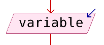
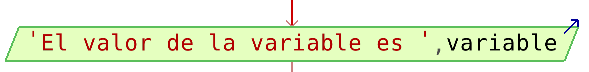

# Entrada y salida de información

## Entrada de datos

Con la instrucción `Leer` permite asignar un valor a una (o varias) variables leído por teclado. Hay que tener en cuenta las mismas consideraciones que en las asignaciones.

	Leer <variable1>, <variable2>, ..., <variableN>;

Ejemplo:

	Definir variable como entero;
	Leer variable;

Como diagrama de flujo:

## Salida de información

Para mostrar información por pantalla utilizamos la instrucción `Escribir`:

	Escribir <dato1>, <dato2>, ..., <datoN>;

Los datos que mostramos pueden ser literales, variables o expresiones.

También podemos utilizar la instrucción `Escribir Sin Saltar`, para que no se introduzca un nueva línea para cada datos mostrado.

Ejemplo:

	Escribir "El valor de la variable es ", variable;

Como diagrama de flujo:

