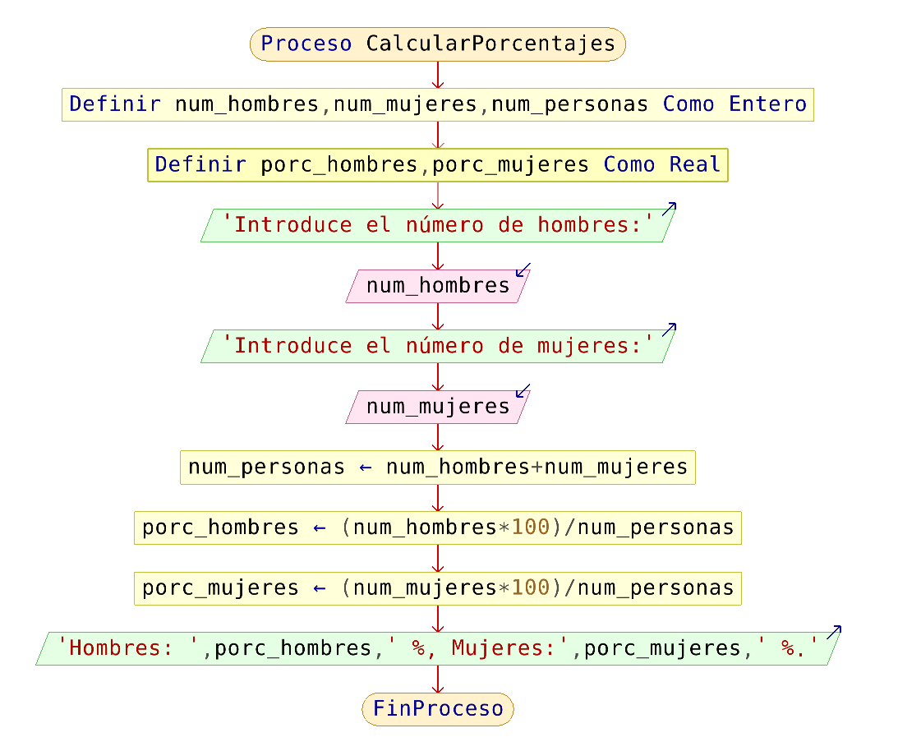

# Nuestro primer pseudocódigo completo

Vamos a resolver un problema completo, siguiendo todas las etapas que hemos estudiado del cilo de desarrollo. El enunciado del problema es el siguiente:

**Queremos saber que porcentaje de hombres y que porcentaje de mujeres hay en un grupo de estudiantes.**

## Análisis

* Definición del problema: Tenemos que saber cuantos hombres y mujeres hay en la clase, y calcular el porcentaje de cada uno.
* Datos de Entradas: Número de hombre y número de mujeres. Valores enteros.
* Información de salida: Porcentaje de hombres y porcentaje de mujeres. Valores reales.
* Variables: `num_hombres`, `num_mujeres` de tipo entero; `porcentaje_hombres`, `porcentaje_mujeres` de tipo real.

## Diseño

Podemos dividir el problema en problemas más pequeños:

* Leer el número de hombres y el número de mujeres.
* Calcular el porcentaje de hombres y mujeres.
* Escribir los porcentajes

Refinamiento del algoritmo

* Leer `num_hombres` y `num_mujeres`
* Calcular el número total de personas (`num_personas`)
* `porc_hombres` = `num_hombres` * 100 / `num_personas`
* `porc_mujeres` = `num_mujeres` * 100 / `num_personas`
* Escribir `porc_hombres`,`porc_mujeres`

Como vemos durante el diseño pueden aparecer nuevas posibles variables 
(variables intermedias), en este caso `num_personas` del tipo entero. Posteriormente cuando construimos el pseudocódigo tendremos que decidir si utilizamos todas las variables.

## Pseudocódigo

	Proceso CalcularPorcentajes
		Definir num_hombres, num_mujeres, num_personas Como Entero;
		Definir porc_hombres, porc_mujeres Como Real;
		Escribir "Introduce el número de hombres:";
		Leer num_hombres;
		Escribir "Introduce el número de mujeres:";
		Leer num_mujeres;
		num_personas <- num_hombres + num_mujeres;
		porc_hombres<- (num_hombres*100) / num_personas;
		porc_mujeres<- (num_mujeres*100) / num_personas;
		Escribir "Hombres: ",porc_hombres," %, Mujeres:",porc_mujeres," %.";
	FinProceso

## Diagrama de flujo

