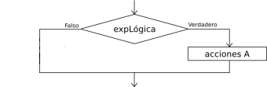
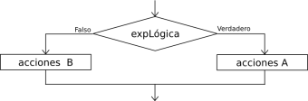

# Estructuras alternativas: si

## Alternativa simple: si - finsi

Al ejecutarse la instrucción `si` se evalúa la condición lógica. Si la condición lógica es **Verdadera** se ejecutan de manera secuencial el bloque de instrucciones *Acciones A*. Si la condición es **Falsa** no se ejecuta el bloque de instrucciones. Una vez ejecutado el `si` (opción verdadera o falsa) se continúa la ejecución de forma secuencial por la siguiente instrucción detrás del `FinSi`.

### Ejemplo

Programa que pida la edad y diga si es mayor de edad.

	Proceso mayor_edad
		Definir edad como entero;
		Escribir "Dime tu edad:";
		Leer edad;
		Si edad>=18 Entonces
			Escribir "Eres mayor de edad";
		FinSi
		Escribir "Programa terminado";
	FinProceso

## Alternativa doble: si - sino - finsi

Al ejecutarse la instrucción `si` se evalúa la condición lógica. Si la condición lógica es **Verdadera** se ejecutan de manera secuencial el bloque de instrucciones *Acciones A*. Si la condición es **Falsa** se ejecuta el bloque de instrucción *Acciones B*.  Una vez ejecutado el `si` (opción verdadera o falsa) se continúa la ejecución de forma secuencial por la siguiente instrucción detrás del `FinSi`.

### Ejemplo

Programa que pida la edad y diga si es mayor de edad o menor de edad.

	Proceso mayor_edad
		Definir edad como entero;
		Escribir "Dime tu edad:";
		Leer edad;
		Si edad>=18 Entonces
			Escribir "Eres mayor de edad";
		SiNo
			Escribir "Eres menor de edad";
		FinSi
		Escribir "Programa terminado";
	FinProceso
