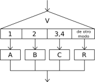

# Estructuras alternativas: Segun

## Alternativa múltiple: Segun

La secuencia de instrucciones ejecutada por una instrucción `Segun` depende del valor de una variable numérica.

    Segun <variable> Hacer
        <número1>: <instrucciones>
        <número2>,<número3>: <instrucciones>
        <...>
        [De Otro Modo: <instrucciones>]
    FinSegun

Esta instrucción permite ejecutar opcionalmente varias acciones posibles, dependiendo del valor almacenado en una variable de tipo numérico. Al ejecutarse, se evalúa el contenido de la variable y se ejecuta la secuencia de instrucciones asociada con dicho valor.
Cada opción está formada por uno o más números separados por comas, dos puntos y una secuencia de instrucciones. Si una opción incluye varios números, la secuencia de instrucciones asociada se debe ejecutar cuando el valor de la variable es uno de esos números.
Opcionalmente, se puede agregar una opción final, denominada `De Otro Modo`, cuya secuencia de instrucciones asociada se ejecutará sólo si el valor almacenado en la variable no coincide con ninguna de las opciones anteriores.
Al finalizar se continúa la ejecución secuencia con la siguiente instrucción detrá del `FinSegun`.

### Ejemplo