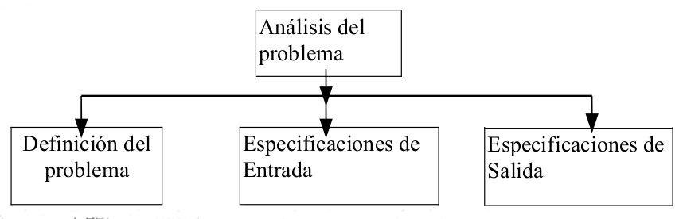

# Análisis del problema

El primer paso, análisis del problema, requiere un estudio a fondo del problema
y de todo lo que hace falta para poder abordarlo.

El propósito del análisis de un problema es ayudar al programador (Analista) para llegar a una cierta comprensión de la naturaleza del problema. Una buena definición del problema, junto con una descripción detallada de las especificaciones de entrada/salida, son los requisitos más importantes para llegar a una solución eficaz.

## Ejemplo de análisis

Nos proponen el siguiente problema:

Leer el radio de un circunferencia y calcular e imprimir su superficie y su longitud.

**Análisis**

**Definición del problema**: Tenemos que saber que es el radio de un circunferencia, y saber que es su área y su longitud. Además tenemos que saber cómo calcular el área y la longitud. Por lo tanto necesitamos saber el radio y utilizar las formulas para calcular el área y la longitud.

|  | Especificaciones |
|------------------------------------------------|-----------------------------------------------|
| **Entradas:** | Radio de la circunferencia (Variable RADIO). |
| **Salidas:**  | Superficie de la circunferencia (Variable SUPERFICIE). Longitud de la circunferencia (Variable LONGITUD) |
| **Variables:**  |RADIO, SUPERFICIE, LONGITUD de tipo REAL.|

Los datos de entrada y la información de salida se van a guardar en **variables**, donde se puede guardar datos. Las variables son de distintos **tipos de datos**: entero, real, cadena, booleano,..

## Especificaciones del problema

El resultado final del análisis es obtener una serie de documentos (**especificación**) en los cuales quedan totalmente definido el proceso a seguir en la resolución del problema.
