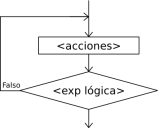

# Estructuras repetitivas: Repetir - Hasta Que

La instrucción `Repetir-Hasta Que` ejecuta una secuencia de instrucciones hasta que la condición sea verdadera.

    Repetir
	    <instrucciones>
    Hasta Que <condición>

* Al ejecutarse esta instrucción, la secuencia de instrucciones que forma el cuerpo del ciclo se ejecuta una vez y luego se evalúa la condición. Si la condición es falsa, el cuerpo del ciclo se ejecuta nuevamente y se vuelve a evaluar la condición. Esto se repite hasta que la condición sea verdadera.
* Note que, dado que la condición se evalúa al final, las instrucciones del cuerpo del ciclo serán ejecutadas al menos una vez.
* Además, a fin de evitar ciclos infinitos, el cuerpo del ciclo debe contener alguna instrucción que modifique la o las variables involucradas en la condición de modo que en algún momento la condición sea verdadera y se finalice la ejecución del ciclo.

## Ejemplo:

Crea un programa que pida al usuario una contraseña, de forma repetitiva mientras que no introduzca "asdasd". Cuando finalmente escriba la contraseña correcta, se le dirá "Bienvenido" y terminará el programa.

	Proceso login
		Definir secreto, clave como cadena;
		secreto <- "asdasd";
		Repetir
			Escribir "Dime la clave:";
			Leer clave;
			Si clave<>secreto Entonces
				Escribir "Clave incorrecta!!!";
			FinSi
		Hasta Que clave=secreto
		Escribir "Bienvenido!!!";
		Escribir "Programa terminado";
	FinProceso