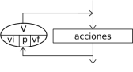

# Estructuras repetitivas: Para

La instrucción `Para` ejecuta una secuencia de instrucciones un número determinado de veces.

    Para <variable> <- <inicial> Hasta <final> [Con Paso <paso>] Hacer
    	<instrucciones>
    FinPara

* Al ingresar al bloque, la variable `<variable>` recibe el valor `<inicial>` y se ejecuta la secuencia de instrucciones que forma el cuerpo del ciclo. 
* Luego se incrementa la variable `<variable>` en `<paso>` unidades y se evalúa si el valor almacenado en `<variable>` superó al valor `<final>`. 
* Si esto es falso se repite hasta que `<variable>` supere a `<final>`. 
* Si se omite la cláusula `Con Paso <paso>`, la variable `<variable>` se incrementará en 1.

## Ejemplo

Escribir en pantalla del 1 al 10.

	Proceso Contar
		Definir var como Entero;
		Para var<-1 Hasta 10 Hacer
			Escribir Sin Saltar var," ";
		FinPara
	FinProceso

Escribir en pantalla de 10 al 1.

	Proceso ContarDescesdente
		Definir var como Entero;
		Para var<-10 Hasta 1 Con Paso -1 Hacer
			Escribir Sin Saltar var," ";
		FinPara
	FinProceso

Escribir los número pares desde el 2 al 10.

	Proceso ContarPares
		Definir var como Entero;
		Para var<-2 Hasta 10 Con Paso 2 Hacer
			Escribir Sin Saltar var," ";
		FinPara
	FinProceso