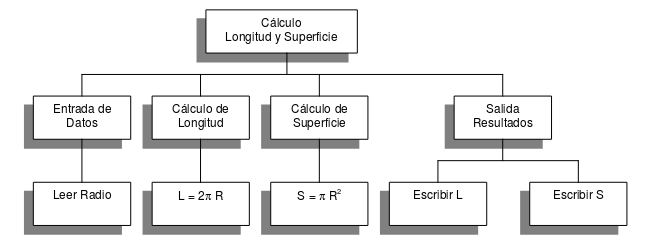

# Diseño de algoritmos

A partir de los requerimientos, resultados del análisis, empieza la etapa de **diseño** donde tenemos que construir un **algoritmo** que resuelva el problema.

## Definición de algoritmo

Un **algoritmo** es un conjunto de acciones que especifican la secuencia de operaciones realizar, en orden, para resolver un problema.

Los algoritmos son independientes tanto del lenguaje de programación como del ordenador que los ejecuta. 

Las características de los algoritmos son:

* Un algoritmo debe ser preciso e indicar el orden de realización de cada paso.
* Un algoritmo debe estar definido. Si se sigue un algoritmo dos veces, se debe
obtener el mismo resultado cada vez.
* Un algoritmo debe ser finito. Si se sigue un algoritmo, se debe terminar en
algún momento; o sea, debe tener un número finito de pasos.

Ejemplo tradicional de un algoritmo: Cambiar la rueda pinchada de un coche.

## Etapa de diseño

Aunque en la solución de problemas sencillos parezca evidente la **codificación** en un lenguaje de programación concreto, es aconsejable realizar el **diseño** del algoritmo, a partir del cual se codifique el programa.

La soluciones a problemas más complejos pueden requerir muchos más pasos. Las estrategias seguidas usualmente a la hora de encontrar algoritmos para problemas complejos son:

* **Partición o divide y vencerás**: consiste en dividir un problema grande en unidades más pequeñas que puedan ser resueltas individualmente. 
	* Ejemplo: Podemos dividir el problema de limpiar una casa en labores más simple correspondientes a limpiar cada habitación.
* **Resolución por analogía**: Dado un problema, se trata de recordar algún problema similar que ya esté resuelto. Los dos problemas análogos pueden incluso pertenecer áreas de conocimiento totalmente distintas.
	* Ejemplo: El cálculo de la media de las temperaturas de las provincias andaluzas y la media de las notas de los alumnos e una clase se realiza del mismo modo.

La descomposición del problema original en subproblemas más simples y a continuación dividir estos subproblemas en otros mas simples se denomina **diseño descendente (top-down design).**
Tras la primera descripción del problema (poco específica), se realiza una
siguiente descripción mas detallada con mas pasos concretos. Este proceso se denomina
**refinamiento del algoritmo**.

## Ejemplo de diseño

Leer el radio de un circunferencia y calcular e imprimir su superficie y su circunferencia.

* Se puede dividir en tres subproblemas más sencillos:

	* Leer Radio
	* Calcular Superficie
	* Calcular Longitud
	* Escribir resultados

* Refinamiento del algoritmo:

	* `Leer Radio`
	* `Superficie <- PI * Radio ^ 2`
	* `Longitud <- 2 * PI * Radio`
	* `Escribir Radio, Longitud, Superficie`

Lo podemos ver en un **diagrama estructurado**:

## Herramientas de representación de algoritmos

* Un **diagrama de flujo** es una de las técnicas de representación gráfica de
algoritmos más antiguas. Ventajas: permite altos niveles de estructuración y modularización y es fácil de usar. Desventajas: son difíciles de actualizar y se complican cuando el algoritmo es grande.
* El **pseudocódigo**, nos permite una aproximación del algoritmo al lenguaje natural y por tanto un a redacción rápida del mismo.
