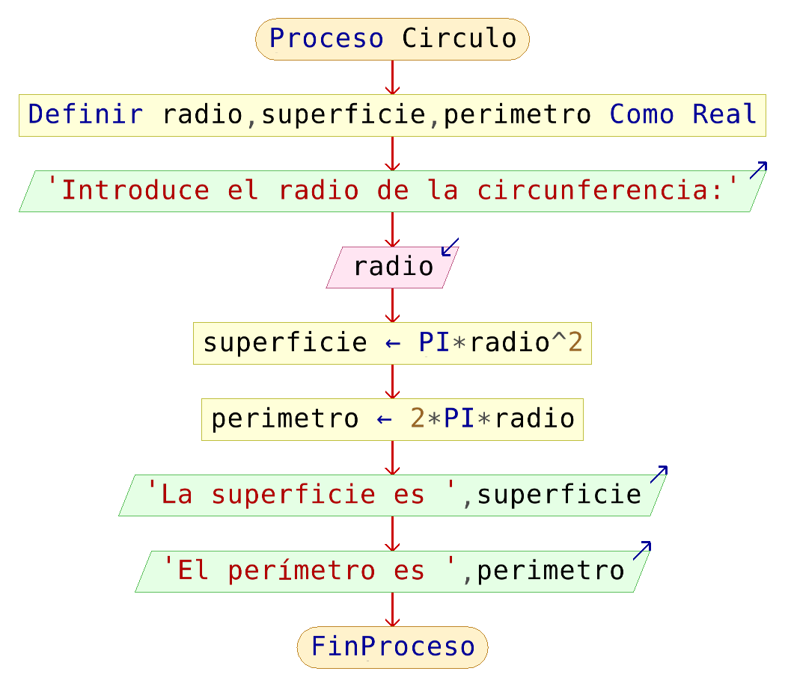

# Estructura del algoritmo

## Opciones del lenguaje (perfiles)

El lenguaje que utilizamos para construir el pseudocódigo no es estándar. Podemos añadir o eliminar algunas reglas de sintaxis sin ningún problema. En la opción *Configurar-Opciones del Lenguaje (perfiles)*, podemos escoger las características del pseudocódigo que vamos a utilizar. Tenemos tres alternativas:

* Escoger un perfil que define un pseudocódigo utilizado en distintos centros educativos y universidades.
* Perfil **flexible**: Está escogido por defecto, y no es muy exigente con las reglas que hay que utilizar para escribir el pseudocódigo.
* Perfil **estricto**: Estable ce una reglas que hacen que el pseudocódigo se parezca más a un lenguaje de programación: se debe definir las variables y sus tipos, las instrucciones deben terminar en punto y coma,...

## Estructura de un algoritmo en pseudocódigo

 Todo algoritmo en pseudocódigo tiene la siguiente estructura general:

    Proceso SinTitulo
        acción 1;
        acción 2;
        ...
        acción n;
    FinProceso

* Comienza con la palabra clave `Proceso` (o alternativamente `Algoritmo`, son sinónimos) seguida del nombre del programa.
* Le sigue una secuencia (**Estructura de control secuencial**) de instrucciones. Una secuencia de instrucciones es una lista de una o más instrucciones y/o estructuras de control.
* Finaliza con la palabra `FinProceso` (o `FinAlgoritmo`). 
* La identación no es significativo, pero se recomienda para que el código sea más legible.
* No se diferencia entre mayúsculas y minúsculas. Preferible las minúsculas, aunque a veces se añaden automáticamente los nombres con la primera letra en mayúsculas.

## Comentarios

Se pueden introducir comentarios luego de una instrucción, o en líneas separadas, mediante el uso de la doble barra ( `//` ). Todo lo que precede a `//`, hasta el fin de la línea, no será tomado en cuenta al interpretar el algoritmo. 

## Nuestro primer programa

Leer el radio de un círculo y calcular e imprimir su superficie y su circunferencia.

El pseudocódigo podría ser:

	//Leer el radio de un círculo y calcular e imprimir su superficie y su circunferencia.
	//Análisis
	//Entradas: Radio del circulo (Variable RADIO).
	//Salidas: Superficie del circulo (Variable SUPERFICIE) y Circunferencia del  circulo (Variable PERIMETRO) 
	//Variables: RADIO, SUPERFICIE, PERIMETRO de tipo REAL	

	Proceso Circulo
		Definir radio,superficie,perimetro como Real;
		Escribir "Introduce el radio de la circunferencia:";
		Leer radio;
		superficie <- PI * radio ^ 2;
		perimetro <- 2 * PI * radio;
		Escribir "La superficie es ",superficie;
		Escribir "El perímetro es ",perimetro;
	FinProceso

Y el diagrama de flujo:

