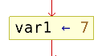

# Asignación de variables

Una vez que hemos definido una variable, podemos asignarle un valor con el operador de asignación (`<-` ó `:=`). El dato que se guarda en una variable puede estar expresado por un literal, guardado en otra variable o calculado tras operar una expresión. Por ejemplo:

	var1 <- 7;
	var2 <- var1;
	var3 <- var1 + var2;

Como diagrama de flujo:

Tenemos que tener en cuenta lo siguiente:

* No se puede asigna un valor a una variable que no haya sido definida con anterioridad.
* No se puede utilizar una variable sin inicializar.
* Con cada asignación se pierde el valor anteriormente guardado en la variable.

Las siguientes asignaciones producen error:

* Una variable real (con parte decimal) si se asigna una variable entera.
* Una variable cadena de caracteres si se asigna a una variable numérica.
* Una variable numérica si se asigna a una variable cadena de caracteres.
* Una asignación de una variable lógica a cualquier otra variable de otro tipo, y al contrario.

## Incremento y decremento de una variable

Al incrementar o decrementar una variable numérica le modificamos su valor sumando o restando un número.

Por ejemplo para incrementar una variable en 1:

	numero1 <- numero1 + 1

Y para decrementar sería algo similar:

	numero1 <- numero1 - 1

## Ejemplo

	Proceso Variables
		Definir numero1, numero2 como Entero;
		Definir superficie, perimetro como Real;
		Definir nombre como Caracter;
		Definir mayor_edad como Logico;	
		//Produce un error: no se ha definido la variable
		numero3 <- 3;
		//Produce un error: no se puede asignar un valor real a un entero
		numero1<-2.5;
		//Produce un error:no se puede utilizar una variable sin inicializar
		numero1<-numero2*3;
		//Produce un error: Asignación de cadena a un número
		nombre<-"Pepe";
		superficie<-nombre;
		//También produce un error lo contrario
		superficie<-2.5;
		nombre<-superficie;
		
		//Inicializamos variables
		perimetro<-3.5;
		superficie<-4;
		numero1<-superficie;
		numero2<-5;
		nombre<-"Pepe";
		mayor_edad<-Verdadero;
		
		//Comprobamos como se actualiza una variable
		numero1<-7;
		numero2<-numero1*2;
		numero2<-numero2+1;
	FinProceso
